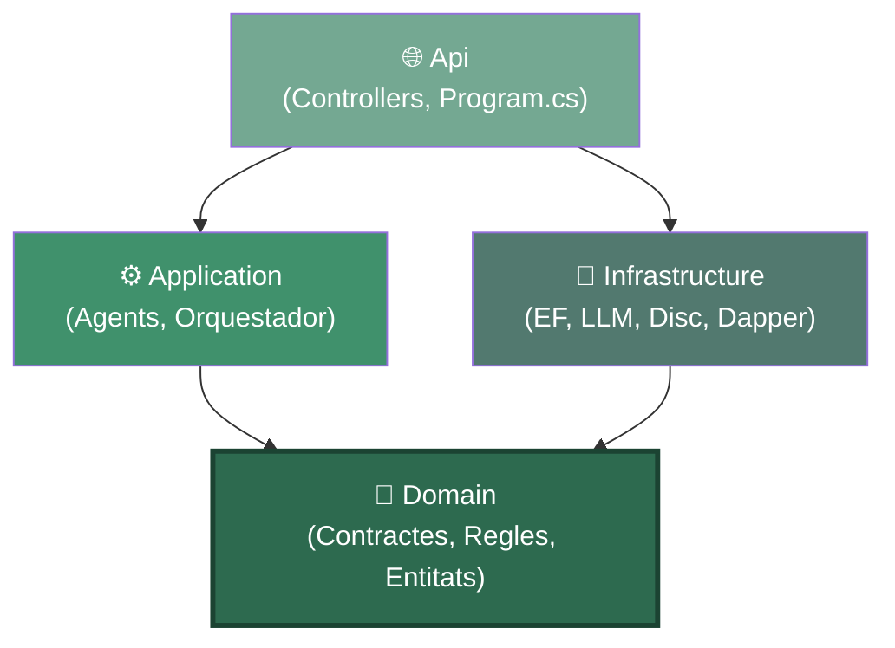
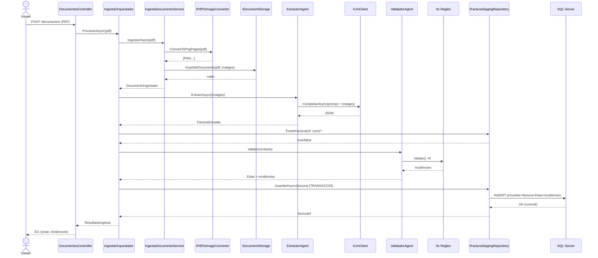

# 🏛️ Arquitectura de DocFlow AI — guia per entendre el codi

> Aquest document explica **què fa cada classe i com es relacionen**, i sobretot **per què** el codi
> està organitzat com està. Està escrit per a algú que ve d'arquitectura clàssica "de N capes" i que
> **no és expert en DDD ni Clean Architecture**. No cal cap coneixement previ d'aquests termes: els
> anirem construint des de zero, amb exemples del nostre propi codi.

---

## 1. El punt de partida: què ja saps (N capes) i què canvia

En una arquitectura **de N capes** tradicional (la que segurament has fet tota la vida), l'aplicació
s'apila com un pastís, i **cada capa depèn de la de sota**:

```
Presentació  (UI / Controllers)
     │  depèn de ↓
Lògica de negoci (Services / BLL)
     │  depèn de ↓
Accés a dades (DAL / Repositoris / EF)
     │  depèn de ↓
Base de dades
```

El problema d'aquest model: **la lògica de negoci depèn de la base de dades**. Si el cor de la teva
aplicació (les regles que decideixen si una factura és vàlida) necessita conèixer Entity Framework o
SQL Server per compilar, llavors:

- No pots provar la lògica sense una base de dades.
- Canviar de SQL Server a un altre motor toca la lògica de negoci.
- El "què fa el negoci" i el "com es guarda" queden barrejats.

**Clean Architecture li dona la volta a la fletxa.** En lloc que el negoci depengui de la
infraestructura, fa que **la infraestructura depengui del negoci**. El negoci queda al centre i **no
depèn de res**:

```
        ┌──────────────────────────────────────────┐
        │                                            │
        │   Api  ───────►  Application  ───────►  Domain   ◄─────── Infrastructure
        │  (web)          (casos d'ús)      (el cor,        (EF, LLM, disc…)
        │                                  sense dependències)
        │                                            │
        └──────────────────────────────────────────┘
                 TOTES les fletxes apunten cap a Domain
```

Fixa't en la diferència clau: **`Infrastructure` (l'accés a dades) apunta cap a `Domain`, no al
revés**. Això és el que en diuen "invertir la dependència", i és tota la màgia. La resta del document
explica com ho aconseguim a la pràctica i què hi guanyem.

---

## 2. La regla d'or: la "regla de la dependència"

Només hi ha **una regla** que ho governa tot, i val la pena memoritzar-la:

> **El codi de dins mai coneix el codi de fora. Les dependències sempre apunten cap endins.**

"Endins" és el `Domain`. "Enfora" és la web, la base de dades, el LLM, el disc.

Traduït al nostre projecte:

- `Domain` **no té cap** `using` de EF Core, de SQL Server, d'ASP.NET, ni del client HTTP del LLM.
  Si obres qualsevol fitxer de `Domain`, només veuràs C# pur. Això és deliberat i és el que el fa
  el "cor estable".
- `Application` coneix `Domain`, però **no** coneix `Infrastructure` ni la web.
- `Infrastructure` i `Api` són les capes "de fora": poden conèixer tot el que hi ha més endins.

Com pot `Application` orquestrar una crida al LLM o guardar a la base de dades **sense conèixer la
infraestructura**? Amb **interfícies definides al `Domain`**. És el mecanisme central i el veurem
en detall a la secció 5.4. Aquesta és la idea que costa més de pair quan véns de N capes, així que
la repetirem amb exemples.

---

## 3. Els 4 projectes d'un cop d'ull

La solució està partida en 4 projectes .NET (+ un de tests). Cadascun és una capa:

| Projecte | Capa | Responsabilitat | De què depèn |
|---|---|---|---|
| **`Domain`** | Nucli | Contractes, regles de negoci, càlculs, entitats. El "què" del negoci. | **De res** (només C#) |
| **`Application`** | Casos d'ús | Orquestra els agents i el flux. El "quan i en quin ordre". | De `Domain` |
| **`Infrastructure`** | Detalls tècnics | EF Core, client LLM, PDF→imatge, disc, Dapper. El "com" tècnic. | De `Domain` |
| **`Api`** | Entrada | Endpoints REST, arrencada, injecció de dependències. La "porta". | De tots |

La regla per decidir on va una classe nova: **pregunta't de què necessita dependre**.
- Si només necessita C# i conceptes del negoci → `Domain`.
- Si necessita coordinar diverses peces del domini → `Application`.
- Si necessita una llibreria externa (EF, HttpClient, un SDK) → `Infrastructure`.
- Si és un endpoint HTTP → `Api`.

---

## 4. Diagrama de dependències entre projectes



**Llegeix les fletxes com "coneix / depèn de".** Observa dues coses:

1. **Totes les fletxes acaben a `Domain`** (el node verd fosc). Ningú no li apunta a l'`Api` ni a
   `Infrastructure` des de dins: són fulles de l'arbre.
2. **`Application` i `Infrastructure` no es coneixen entre si.** `Application` demana feina a través
   d'interfícies de `Domain`; qui les implementa (`Infrastructure`) l'hi injecta l'`Api` en arrencar.
   Aquesta és la inversió de dependència en acció.

---

## 5. `Domain` — el cor del sistema (en detall)

Aquest és el projecte més important i el que més conceptes nous introdueix. Conté 5 tipus de coses.

### 5.1 `Entities/` — les entitats de persistència

Són les classes que es mapegen a taules de SQL Server via EF Core.

| Classe | Taula | Què representa |
|---|---|---|
| `Proveedor` | `Proveedores` | Un proveïdor donat d'alta (per NIF únic) |
| `FacturaStaging` | `FacturasStaging` | La capçalera d'una factura processada |
| `FacturaLinea` | `FacturasLineas` | Una línia de detall d'una factura |
| `ValidacionIncidencia` | `ValidacionIncidencias` | Un motiu de revisió/rebuig d'una factura |
| `ProveedorEjemplo` | `ProveedorEjemplos` | Exemple few-shot d'un proveïdor (buit fins a E2) |
| `EstadoFactura` (enum) | — | `PendienteValidacion · Validada · RevisionHumana · Rechazada · IntegradaERP` |

**Nota honesta sobre aquestes entitats i el DDD**: en un DDD "de llibre", una entitat com
`FacturaStaging` tindria mètodes que protegeixen les seves pròpies regles (per exemple, prohibir
passar de `Rechazada` a `IntegradaERP`). Ara mateix **són classes de només dades** (el que en diuen
un *anemic model*), i **està bé que sigui així de moment**: en aquesta fase només hi ha un lloc que
escriu l'estat (l'orquestador, en crear la fila), o sigui que no hi ha cap invariant que ningú pugui
violar. Quan a l'Etapa 2 apareguin transicions d'estat de veritat (revisió humana, integració ERP),
afegirem una màquina d'estats aquí. **La lògica s'afegeix quan hi ha un risc real que protegir, no
per cerimònia.**

### 5.2 `ValueObjects/` — conceptes del domini amb regles pròpies

Un **value object** (objecte-valor) és un concepte del negoci que no és una entitat (no té Id ni
cicle de vida) però que **encapsula regles**. La diferència amb un `string` pelat és que centralitza
el coneixement en un sol lloc.

**`Nif`** (`ValueObjects/Nif.cs`) és el nostre únic value object ara mateix. Abans, el concepte "NIF"
estava escampat: la normalització ("B-12.345.678" → "B12345678") vivia al parser d'extracció, i la
validació de format vivia en una regla de validació. Dos llocs pel mateix concepte. Ara tot viu aquí:

```csharp
Nif.Normalizar("B-12.345.678")   // → "B12345678"  (treu guions, punts, espais, majúscules)
Nif.FormatoValido("B12345678")   // → true          (regex ES + VAT UE)
```

Qui necessiti normalitzar o validar un NIF (el parser, la regla `NIF_FORMATO`) delega aquí. Un canvi
a les regles del NIF es fa en un únic fitxer.

### 5.3 `Validacion/` — les regles de negoci (patró Strategy)

Aquí viu el comportament de negoci més valuós del sistema: **les 9 regles que decideixen si una
factura és vàlida**. Estan organitzades amb el patró **Strategy**.

> **Patró Strategy explicat des de zero**: en lloc d'un mètode gegant amb un `if` per cada regla,
> defineixes una **interfície** (`IReglaValidacion`) i **una classe petita per cada regla**. Totes
> compleixen el mateix contracte. Qui les fa servir (el `ValidadorAgent`) no sap quantes n'hi ha ni
> què fa cadascuna: només les recorre totes. Afegir una regla десena és crear una classe nova, sense
> tocar res del que ja funciona. És l'oposat al "mètode de 400 línies amb 9 ifs".

La interfície (`Validacion/IReglaValidacion.cs`):

```csharp
public interface IReglaValidacion
{
    string Codigo { get; }                                  // p.ex. "CUADRE_TOTAL"
    IEnumerable<Incidencia> Validar(ContextoValidacion ctx); // retorna 0..N incidències
}
```

El `ContextoValidacion` és una capsa amb tot el que les regles necessiten per decidir **ja
precalculat**, perquè les regles siguin **pures** (no toquen BD ni rellotge):

```csharp
record ContextoValidacion(
    FacturaExtraida Factura,       // la factura a validar
    bool ExisteDuplicado,          // ← el calcula l'orquestador consultant la BD
    DateOnly FechaReferencia,      // ← "avui" injectat, perquè el test sigui reproduïble
    decimal ToleranciaCuadre);     // ← ±0,02 € de la config
```

Les 9 regles (a `Validacion/Reglas/`), amb la seva severitat:

| Classe | Codi | Severitat | Comprova |
|---|---|---|---|
| `ReglaCuadreLineas` | `CUADRE_LINEAS` | Revisió | Σ(línies) ≈ base imposable |
| `ReglaCuadreTotal` | `CUADRE_TOTAL` | Revisió | base + IVA − IRPF ≈ total |
| `ReglaIvaCoherente` | `IVA_COHERENTE` | Revisió | quota IVA ≈ Σ(base·%IVA) |
| `ReglaReverseCharge` | `REVERSE_CHARGE_OK` | Info | reverse charge → IVA ha de ser 0 |
| `ReglaNifFormato` | `NIF_FORMATO` | Revisió | format de NIF vàlid (delega a `Nif`) |
| `ReglaCamposObligatorios` | `CAMPOS_OBLIGATORIOS` | **Rebuig** | nif, número, data, total presents |
| `ReglaConfidenceMinima` | `CONFIDENCE_MINIMA` | Revisió | cap camp obligatori amb confiança < 0,7 |
| `ReglaFechaRazonable` | `FECHA_RAZONABLE` | Revisió | data ni futura ni de fa >10 anys |
| `ReglaDuplicado` | `DUPLICADO` | **Rebuig** | (proveïdor + número) ja existeix |

**Punt clau del refactor recent**: aquestes regles només contenen **política** (quина severitat, quin
missatge), no **càlcul**. Quan una regla necessita saber "quant sumen les línies" o "quin és el total
teòric", **ho pregunta al model** (secció 5.5), no s'ho calcula ella. Així el coneixement fiscal viu
en un sol lloc i les regles queden a una línia:

```csharp
// ReglaCuadreTotal, versió actual: el CÀLCUL és del model, la DECISIÓ és de la regla
var diferencia = Math.Abs(t.TotalCalculado!.Value - t.Total.Value);
if (diferencia > contexto.ToleranciaCuadre)
    yield return new Incidencia(Codigo, "...", SeveridadIncidencia.Revision);
```

### 5.4 `Contracts/` — les interfícies (el mecanisme clau de tota l'arquitectura)

**Aquesta carpeta és la que fa possible la "inversió de dependència".** Presta-hi atenció perquè és
el concepte que costa més de pair venint de N capes.

El problema: `Application` necessita, per exemple, cridar el LLM. Però el LLM viu a `Infrastructure`
(un client HTTP amb un SDK), i `Application` **no pot conèixer `Infrastructure`** (trencaria la regla
de la dependència). Com ho resol?

**Solució**: `Domain` defineix una **interfície** que descriu *què* necessita, sense dir *com*:

```csharp
// Domain/Contracts/ILlmClient.cs — el DOMINI diu "necessito algú que sàpiga parlar amb un LLM"
public interface ILlmClient
{
    Task<string> CompletarAsync(LlmPeticion peticion, CancellationToken ct = default);
}
```

`Application` treballa **només contra aquesta interfície**. Mai veu el client HTTP real.
`Infrastructure` és qui la **implementa** (`OpenAiCompatibleLlmClient`), i l'`Api` és qui, en
arrencar, diu "quan algú demani un `ILlmClient`, dona-li aquesta implementació concreta".

Resultat: pots canviar de Groq a un LLM local **sense tocar ni una línia** de `Domain` ni
`Application`. De fet ho hem fet: és tota la gràcia de tenir perfils de proveïdor.

Les interfícies (contractes) que viuen a `Domain/Contracts/`:

| Interfície | Què demana el domini | Qui la implementa (a `Infrastructure`) |
|---|---|---|
| `ILlmClient` | "Parla amb un LLM i torna'm text" | `OpenAiCompatibleLlmClient` |
| `IPdfToImageConverter` | "Converteix un PDF en imatges PNG" | `PdfiumPdfToImageConverter` |
| `IDocumentStorage` | "Guarda i recupera PDF/imatges" | `FileSystemDocumentStorage` |
| `IFacturaStagingRepository` | "Persisteix una factura (transaccional)" | `FacturaStagingRepository` |
| `IConsultaSqlEjecutor` | "Executa un SELECT ja validat" | `DapperConsultaSqlEjecutor` |

En aquesta mateixa carpeta hi ha també els **DTOs / contractes de dades** que no són entitats de BD:

- **`FacturaExtraida`** (i els seus fills `EmisorExtraido`, `LineaExtraida`, `TotalesExtraidos`…):
  el resultat de l'extracció del LLM. És un `record` immutable, sense identitat ni cicle de vida →
  un DTO de debò. **Aquí sí que hi ha lògica** (vegeu 5.5).
- **`DocumentoIngestado`**: resultat de la ingesta (Id + rutes).
- **`LlmPeticion`**, **`ResultadoConsultaSql`**: paràmetres/resultats de les interfícies.

> **Per què `FacturaExtraida` és un DTO amb lògica però `FacturaStaging` és una entitat sense
> lògica?** No es distingeixen per tenir mètodes, sinó per tenir **identitat i cicle de vida**.
> `FacturaExtraida` és un valor de pas (dues extraccions iguals són intercanviables) → tota la lògica
> de càlcul hi encaixa de forma natural. `FacturaStaging` té Id i evoluciona d'estat → és una entitat,
> i la seva lògica (transicions) arribarà quan calgui protegir-la.

### 5.5 `FacturaExtraida` amb comportament — "el model respon preguntes"

Aquest és el resultat del refactor "anti-anèmia". La idea en una frase:

> **El model respon preguntes ("quant sumen les línies?"); les regles prenen decisions ("si no
> quadra, Revisió").**

`FacturaExtraida` i els seus fills tenen mètodes de càlcul que abans vivien escampats per les regles:

```csharp
factura.SumaLineas()                    // Σ importes de línia (o null si en falta algun)
factura.ImporteObjetivoLineas()         // base, o base+IVA si les línies porten IVA
factura.CuotaIvaCalculadaPorLineas()    // Σ (base_línia · %IVA)
factura.CamposObligatoriosAusentes()    // ["emisor.nif", "totales.total"...]
totales.TotalCalculado                  // base + IVA − IRPF
linea.BaseImponible(incluyeIva)         // deriva la base d'un import amb IVA inclòs
```

Benefici concret: el dia que necessitem derivar la base de la plantilla B (que només imprimeix el
total amb IVA), el mètode `linea.BaseImponible(incluyeIva: true)` **ja existeix i està testejat**, no
cal reescriure aritmètica fiscal en cap altre lloc.

### 5.6 `Parsers/` — normalitzadors purs

`NumeroParser` ("1.234,56 €" → `1234.56m`) i `FechaParser` ("5 de juliol 2026" → "2026-07-05"). Són
funcions pures de domini: converteixen el que el document diu al format del contracte. Viuen al
`Domain` perquè és coneixement del negoci (com s'escriuen imports i dates a Espanya) i no necessiten
res extern.

---

## 6. `Application` — els casos d'ús (els "agents" i l'orquestador)

Aquesta capa **no fa feina tècnica** (no toca EF ni HTTP directament): **coordina**. Diu qui fa què i
en quin ordre, sempre a través de les interfícies de `Domain`.

### 6.1 Els agents

Cada "agent" del SPEC és una classe aquí:

- **`ExtractorAgent`** (`Extraccion/`): agafa les imatges, carrega el prompt versionat, crida
  l'`ILlmClient`, i passa la resposta al `FacturaExtraidaParser`. Si el JSON torna malament, fa **1
  reintent amb feedback**. Retorna un `ResultadoExtraccion`.
- **`FacturaExtraidaParser`** (`Extraccion/`): converteix el text del LLM en un `FacturaExtraida`
  vàlid. És **tolerant** (accepta JSON envoltat de text o de ```` ```json ````), i aplica la xarxa de
  seguretat del contracte: camp absent → null + confiança 0, mai inventar.
- **`ValidadorAgent`** (`Validacion/`): rep **totes les regles injectades** (`IEnumerable<IReglaValidacion>`),
  les executa totes, i deriva l'estat final: `Rechazada` si hi ha algun rebuig, `RevisionHumana` si
  hi ha alguna revisió, `Validada` si no hi ha res. Les `Info` no penalitzen.
- **`ConsultorAgent`** (`Consultor/`): pregunta NL → SQL (via LLM) → **SQL-guard** → execució (via
  `IConsultaSqlEjecutor`) → redacció de la resposta (via LLM). Amb reintent si el SQL falla en
  executar-se; **mai** reintenta si el guard el bloqueja (postura de seguretat).
- **`SqlGuard`** (`Consultor/`): el validador de seguretat. Només SELECT, una sentència, sense
  comentaris, whitelist de 4 taules, paraules prohibides, `TOP 1000` forçat. **Corre sempre abans de
  tocar la BD.** Viu a `Application` perquè és lògica pura (no necessita la BD per validar el text).

### 6.2 L'orquestador — el director d'orquestra

**`IngestaOrquestador`** (`Ingesta/IngestaOrquestador.cs`) és el cor del flux d'ingesta. Encadena
els passos i garanteix la **transaccionalitat**:

```
IngestaDocumentoService  →  ExtractorAgent  →  (consulta duplicat)  →  ValidadorAgent  →  repositori (transacció)
```

> **Per què un orquestador "manual" i no un framework?** El SPEC (Etapa 2) el substituirà per
> Microsoft Agent Framework. La gràcia és que **els agents no canviaran**: només canviarà qui els
> encadena. L'orquestador és una peça deliberadament aïllada per poder-la reemplaçar.

### 6.3 Utilitats compartides

- **`PromptLoader`**: carrega els prompts versionats (fitxers `.md` incrustats a l'assembly) i els
  separa en part de sistema / usuari.
- **`LlmRespuesta`**: localitza el primer objecte JSON dins la resposta del LLM (compartit entre
  Extractor i Consultor).
- **`Prompts/*.md`**: els prompts com a fitxers versionats (`extraccion-generica.md`,
  `consultor-sql.md`). Es versionen com codi.

---

## 7. `Infrastructure` — els detalls tècnics

Aquí viu tot el que "s'embruta les mans" amb tecnologia concreta. **Cada classe d'aquí implementa una
interfície de `Domain`.**

| Classe | Implementa | Tecnologia |
|---|---|---|
| `OpenAiCompatibleLlmClient` | `ILlmClient` | `HttpClient` contra API estil OpenAI (Groq / LM Studio) |
| `PdfiumPdfToImageConverter` | `IPdfToImageConverter` | Llibreria PDFtoImage/Pdfium |
| `FileSystemDocumentStorage` | `IDocumentStorage` | Disc local (`App_Data/`) |
| `FacturaStagingRepository` | `IFacturaStagingRepository` | EF Core + transacció explícita |
| `DapperConsultaSqlEjecutor` | `IConsultaSqlEjecutor` | Dapper (consultes del Consultor) |
| `DocFlowDbContext` | — | El `DbContext` d'EF Core |
| `Persistence/Configurations/*` | — | Mapatge Fluent API de cada entitat a la seva taula |
| `LlmOptions`, `StorageOptions` | — | Classes d'opcions (bind des de config) |

> **Per què EF Core per a la ingesta i Dapper per al Consultor?** EF va bé per escriure objectes amb
> relacions (factura + línies + incidències en cascada). Dapper va bé per executar SQL arbitrari i
> materialitzar files dinàmiques — exactament el que fa el Consultor amb el SQL generat pel LLM. El
> SPEC (§3) ho demana així.

**Detall de la transacció** a `FacturaStagingRepository.GuardarAsync`: obre una transacció explícita,
dona d'alta el proveïdor si no existeix, afegeix la factura (amb línies i incidències en cascada), i
fa commit. Si qualsevol pas peta, **res es guarda** (tot o res).

---

## 8. `Api` — la porta d'entrada

- **`Program.cs`**: arrenca el web, llegeix el paràmetre `--llm`, registra les capes
  (`AddApplication()` + `AddInfrastructure()`), i és **l'únic lloc on totes les peces es connecten**
  (on es diu "aquesta interfície → aquesta implementació"). Això es diu **arrel de composició**.
- **`Controllers/`**:
  - `DocumentosController`: `POST /documentos` (pipeline complet o només ingesta amb `?procesar=false`),
    `POST /documentos/{id}/extraccion` (extracció sense persistir, per depurar/evaluar).
  - `FacturasController`: `GET /facturas` (llista amb estats), `GET /facturas/{id}` (detall amb
    línies i incidències).
  - `ConsultasController`: `POST /consultas` (pregunta NL → resposta + SQL executat).

Els controllers són **primets a propòsit**: reben la petició, criden l'agent o orquestador que
correspongui, i tornen el resultat. No tenen lògica de negoci.

---

## 9. Com es relacionen les classes (diagrama)


Les línies contínues són "usa"; les puntejades "implementa". Fixa't com **`Application` (els agents)
sempre apunta a interfícies del `Domain`** (les caixes amb `/barres/`), i és `Infrastructure` qui les
implementa des de fora. Cap agent coneix una classe concreta d'`Infrastructure`.

---

## 10. El flux complet, pas a pas (pujar una factura)



Observa que **el controller mai parla amb el LLM ni amb la BD directament**: només amb l'orquestador.
I l'orquestador mai coneix Groq ni SQL Server: només interfícies. Aquesta indirecció és precisament
el que ens deixa canviar de LLM o afegir MAF sense trencar res.

---

## 11. Glossari DDD ↔ el que ja coneixes

| Terme DDD / Clean | Traducció "de N capes" | Al nostre codi |
|---|---|---|
| **Domain** | La BLL, però sense EF a dins | Projecte `Domain` |
| **Entity** | Una classe que mapeja a taula, amb identitat | `FacturaStaging`, `Proveedor` |
| **Value Object** | Un tipus que encapsula un concepte + regles | `Nif` |
| **DTO / Contracte** | Classe de transport de dades | `FacturaExtraida`, `DocumentoIngestado` |
| **Repository** | El teu DAL, però darrere una interfície del domini | `IFacturaStagingRepository` |
| **Use Case / Application Service** | El teu Service de la BLL | `IngestaOrquestador`, els agents |
| **Inversió de dependència** | (nou) La BLL defineix interfícies, la DAL les implementa | `Contracts/` + `Infrastructure/` |
| **Arrel de composició** | El `Startup`/arrencada on registres tot a la DI | `Program.cs` |
| **Strategy** | (patró) Una classe per variant en lloc d'un switch | Les 9 `IReglaValidacion` |
| **Model anèmic** | Classes de només dades (getters/setters) | Les `Entities/` (de moment, i és correcte) |

---

## 12. Què ens aporta tot això (resum del "per què")

1. **Es pot provar sense infraestructura.** Els 133 tests unitaris corren sense base de dades ni LLM
   reals, perquè la lògica (regles, parsers, orquestador, guard) depèn d'interfícies que substituïm
   per dobles de prova. En N capes clàssic això és molt més difícil perquè la BLL arrossega la DAL.

2. **Es pot canviar la tecnologia sense tocar el negoci.** Ho hem demostrat: passar de Groq a un LLM
   local va ser configuració pura, zero canvis a `Domain`/`Application`. El mateix valdrà per canviar
   de SQL Server o per introduir Microsoft Agent Framework a l'Etapa 2.

3. **Cada peça té un únic motiu per canviar.** Una regla de negoci nova → toques `Domain/Validacion`.
   Un canvi de format de PDF → toques `Infrastructure/Pdf`. Un endpoint nou → toques `Api`. No hi ha
   el típic fitxer que ho barreja tot i que trenca tres coses cada cop que el toques.

4. **El coneixement de negoci està en un sol lloc i és fàcil de trobar.** Les regles fiscals estan a
   `Domain`, no repartides entre controllers i serveis. Un desenvolupador nou llegeix `Domain` i
   entén *què* fa el sistema sense perdre's en detalls de HTTP o SQL.

**El cost honest**: hi ha més projectes i més interfícies que en una app de N capes petita. Per a un
CRUD trivial seria sobredimensionat. Aquí es justifica perquè el negoci és el valor (extracció +
validació + consulta segura) i volem poder-lo evolucionar i provar amb confiança durant l'Etapa 2.

---

## 13. Mapa ràpid de fitxers (per anar-hi directe)

```
src/
├── Domain/                        ← el cor, sense dependències
│   ├── Contracts/                 ← INTERFÍCIES (ILlmClient, IRepo...) + DTOs (FacturaExtraida)
│   ├── Entities/                  ← taules EF (FacturaStaging, Proveedor, EstadoFactura...)
│   ├── ValueObjects/              ← Nif
│   ├── Validacion/                ← IReglaValidacion + Reglas/ (les 9 regles)
│   └── Parsers/                   ← NumeroParser, FechaParser
├── Application/                   ← casos d'ús, coordina via interfícies
│   ├── Ingesta/                   ← IngestaOrquestador, IngestaDocumentoService
│   ├── Extraccion/                ← ExtractorAgent, FacturaExtraidaParser
│   ├── Validacion/                ← ValidadorAgent
│   ├── Consultor/                 ← ConsultorAgent, SqlGuard
│   ├── Prompts/                   ← *.md versionats + PromptLoader
│   └── Llm/                       ← LlmRespuesta
├── Infrastructure/                ← detalls tècnics, implementa les interfícies
│   ├── Llm/                       ← OpenAiCompatibleLlmClient, LlmOptions
│   ├── Pdf/                       ← PdfiumPdfToImageConverter
│   ├── Storage/                   ← FileSystemDocumentStorage
│   ├── Consultor/                 ← DapperConsultaSqlEjecutor
│   └── Persistence/               ← DocFlowDbContext, Repository, Configurations/
└── Api/                           ← la porta REST
    ├── Program.cs                 ← arrel de composició (registra-ho tot)
    └── Controllers/               ← Documentos, Facturas, Consultas
```
