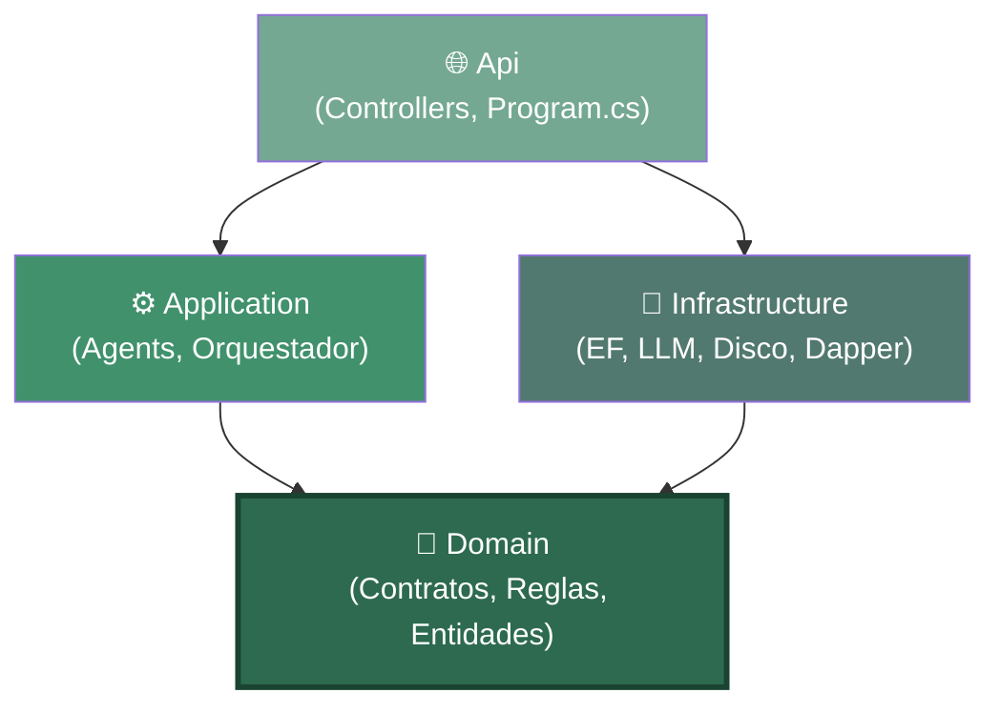
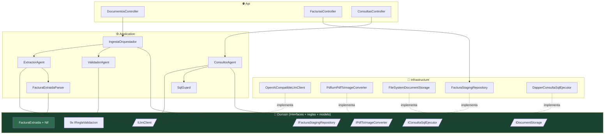
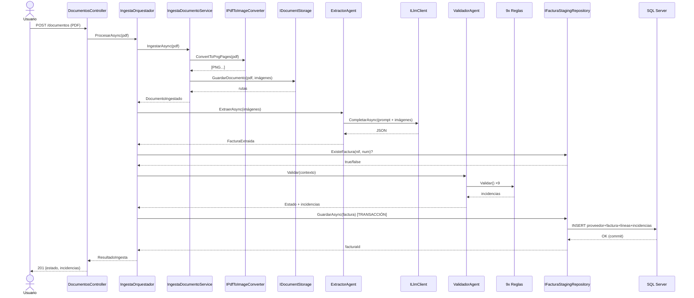

# 🏛️ Arquitectura de DocFlow AI — guía para entender el código

> Este documento explica **qué hace cada clase y cómo se relacionan**, y sobre todo **por qué** el código
> está organizado como está. Está escrito para alguien que viene de arquitectura clásica "de N capas" y que
> **no es experto en DDD ni Clean Architecture**. No hace falta ningún conocimiento previo de estos términos: los
> iremos construyendo desde cero, con ejemplos de nuestro propio código.

---

## 1. El punto de partida: qué ya sabes (N capas) y qué cambia

En una arquitectura **de N capas** tradicional (la que seguramente has hecho toda la vida), la aplicación
se apila como un pastel, y **cada capa depende de la de abajo**:

```
Presentación  (UI / Controllers)
     │  depende de ↓
Lógica de negocio (Services / BLL)
     │  depende de ↓
Acceso a datos (DAL / Repositorios / EF)
     │  depende de ↓
Base de datos
```

El problema de este modelo: **la lógica de negocio depende de la base de datos**. Si el corazón de tu
aplicación (las reglas que deciden si una factura es válida) necesita conocer Entity Framework o
SQL Server para compilar, entonces:

- No puedes probar la lógica sin una base de datos.
- Cambiar de SQL Server a otro motor toca la lógica de negocio.
- El "qué hace el negocio" y el "cómo se guarda" quedan mezclados.

**Clean Architecture le da la vuelta a la flecha.** En lugar de que el negocio dependa de la
infraestructura, hace que **la infraestructura dependa del negocio**. El negocio queda en el centro y **no
depende de nada**:

```
        ┌──────────────────────────────────────────┐
        │                                            │
        │   Api  ───────►  Application  ───────►  Domain   ◄─────── Infrastructure
        │  (web)          (casos de uso)    (el corazón,     (EF, LLM, disco…)
        │                                  sin dependencias)
        │                                            │
        └──────────────────────────────────────────┘
                 TODAS las flechas apuntan a Domain
```

Fíjate en la diferencia clave: **`Infrastructure` (el acceso a datos) apunta hacia `Domain`, no al
revés**. Esto es lo que llaman "invertir la dependencia", y es toda la magia. El resto del documento
explica cómo lo conseguimos en la práctica y qué ganamos con ello.

---

## 2. La regla de oro: la "regla de la dependencia"

Solo hay **una regla** que lo gobierna todo, y vale la pena memorizarla:

> **El código de dentro nunca conoce el código de fuera. Las dependencias siempre apuntan hacia adentro.**

"Adentro" es el `Domain`. "Afuera" es la web, la base de datos, el LLM, el disco.

Traducido a nuestro proyecto:

- `Domain` **no tiene ningún** `using` de EF Core, de SQL Server, de ASP.NET, ni del cliente HTTP del LLM.
  Si abres cualquier fichero de `Domain`, solo verás C# puro. Esto es deliberado y es lo que lo convierte
  en el "corazón estable".
- `Application` conoce `Domain`, pero **no** conoce `Infrastructure` ni la web.
- `Infrastructure` y `Api` son las capas "de fuera": pueden conocer todo lo que hay más adentro.

¿Cómo puede `Application` orquestar una llamada al LLM o guardar en la base de datos **sin conocer la
infraestructura**? Con **interfaces definidas en el `Domain`**. Es el mecanismo central y lo veremos
en detalle en la sección 5.4. Esta es la idea que más cuesta asimilar cuando vienes de N capas, así que
la repetiremos con ejemplos.

---

## 3. Los 4 proyectos de un vistazo

La solución está partida en 4 proyectos .NET (+ uno de tests). Cada uno es una capa:

| Proyecto | Capa | Responsabilidad | De qué depende |
|---|---|---|---|
| **`Domain`** | Núcleo | Contratos, reglas de negocio, cálculos, entidades. El "qué" del negocio. | **De nada** (solo C#) |
| **`Application`** | Casos de uso | Orquesta los agentes y el flujo. El "cuándo y en qué orden". | De `Domain` |
| **`Infrastructure`** | Detalles técnicos | EF Core, cliente LLM, PDF→imagen, disco, Dapper. El "cómo" técnico. | De `Domain` |
| **`Api`** | Entrada | Endpoints REST, arranque, inyección de dependencias. La "puerta". | De todos |

La regla para decidir dónde va una clase nueva: **pregúntate de qué necesita depender**.
- Si solo necesita C# y conceptos del negocio → `Domain`.
- Si necesita coordinar varias piezas del dominio → `Application`.
- Si necesita una librería externa (EF, HttpClient, un SDK) → `Infrastructure`.
- Si es un endpoint HTTP → `Api`.

---

## 4. Diagrama de dependencias entre proyectos



**Lee las flechas como "conoce / depende de".** Observa dos cosas:

1. **Todas las flechas acaban en `Domain`** (el nodo verde oscuro). Nadie apunta a la `Api` ni a
   `Infrastructure` desde dentro: son hojas del árbol.
2. **`Application` e `Infrastructure` no se conocen entre sí.** `Application` pide trabajo a través
   de interfaces de `Domain`; quien las implementa (`Infrastructure`) se lo inyecta la `Api` al arrancar.
   Esta es la inversión de dependencia en acción.

---

## 5. `Domain` — el corazón del sistema (en detalle)

Este es el proyecto más importante y el que más conceptos nuevos introduce. Contiene 5 tipos de cosas.

### 5.1 `Entities/` — las entidades de persistencia

Son las clases que se mapean a tablas de SQL Server vía EF Core.

| Clase | Tabla | Qué representa |
|---|---|---|
| `Proveedor` | `Proveedores` | Un proveedor dado de alta (por NIF único) |
| `FacturaStaging` | `FacturasStaging` | La cabecera de una factura procesada |
| `FacturaLinea` | `FacturasLineas` | Una línea de detalle de una factura |
| `ValidacionIncidencia` | `ValidacionIncidencias` | Un motivo de revisión/rechazo de una factura |
| `ProveedorEjemplo` | `ProveedorEjemplos` | Ejemplo few-shot de un proveedor (vacío hasta E2) |
| `EstadoFactura` (enum) | — | `PendienteValidacion · Validada · RevisionHumana · Rechazada · IntegradaERP` |

**Nota honesta sobre estas entidades y el DDD**: en un DDD "de libro", una entidad como
`FacturaStaging` tendría métodos que protegen sus propias reglas (por ejemplo, prohibir
pasar de `Rechazada` a `IntegradaERP`). Ahora mismo **son clases de solo datos** (lo que llaman
un *anemic model*), y **está bien que sea así de momento**: en esta fase solo hay un sitio que
escribe el estado (el orquestador, al crear la fila), o sea que no hay ningún invariante que nadie pueda
violar. Cuando en la Etapa 2 aparezcan transiciones de estado de verdad (revisión humana, integración ERP),
añadiremos una máquina de estados aquí. **La lógica se añade cuando hay un riesgo real que proteger, no
por ceremonia.**

### 5.2 `ValueObjects/` — conceptos del dominio con reglas propias

Un **value object** (objeto-valor) es un concepto del negocio que no es una entidad (no tiene Id ni
ciclo de vida) pero que **encapsula reglas**. La diferencia con un `string` pelado es que centraliza
el conocimiento en un solo lugar.

**`Nif`** (`ValueObjects/Nif.cs`) es nuestro único value object ahora mismo. Antes, el concepto "NIF"
estaba disperso: la normalización ("B-12.345.678" → "B12345678") vivía en el parser de extracción, y la
validación de formato vivía en una regla de validación. Dos sitios para el mismo concepto. Ahora todo vive aquí:

```csharp
Nif.Normalizar("B-12.345.678")   // → "B12345678"  (quita guiones, puntos, espacios, mayúsculas)
Nif.FormatoValido("B12345678")   // → true          (regex ES + VAT UE)
```

Quien necesite normalizar o validar un NIF (el parser, la regla `NIF_FORMATO`) delega aquí. Un cambio
en las reglas del NIF se hace en un único fichero.

### 5.3 `Validacion/` — las reglas de negocio (patrón Strategy)

Aquí vive el comportamiento de negocio más valioso del sistema: **las 9 reglas que deciden si una
factura es válida**. Están organizadas con el patrón **Strategy**.

> **Patrón Strategy explicado desde cero**: en lugar de un método gigante con un `if` por cada regla,
> defines una **interfaz** (`IReglaValidacion`) y **una clase pequeña por cada regla**. Todas
> cumplen el mismo contrato. Quien las usa (el `ValidadorAgent`) no sabe cuántas hay ni
> qué hace cada una: solo las recorre todas. Añadir una regla décima es crear una clase nueva, sin
> tocar nada de lo que ya funciona. Es lo opuesto al "método de 400 líneas con 9 ifs".

La interfaz (`Validacion/IReglaValidacion.cs`):

```csharp
public interface IReglaValidacion
{
    string Codigo { get; }                                  // p.ej. "CUADRE_TOTAL"
    IEnumerable<Incidencia> Validar(ContextoValidacion ctx); // retorna 0..N incidencias
}
```

El `ContextoValidacion` es una caja con todo lo que las reglas necesitan para decidir **ya
precalculado**, para que las reglas sean **puras** (no tocan BD ni reloj):

```csharp
record ContextoValidacion(
    FacturaExtraida Factura,       // la factura a validar
    bool ExisteDuplicado,          // ← lo calcula el orquestador consultando la BD
    DateOnly FechaReferencia,      // ← "hoy" inyectado, para que el test sea reproducible
    decimal ToleranciaCuadre);     // ← ±0,02 € de la config
```

No se construye directamente: el orquestador usa la factoría estática `ContextoValidacion.Crear(...)`,
que antes de nada aplica la autocorrección de `LineasIncluyenIva` (ver 5.5) sobre la factura. Así todas
las reglas ven ya la interpretación correcta, sin que cada una tenga que lidiar con la ambigüedad.

Las 9 reglas (en `Validacion/Reglas/`), con su severidad:

| Clase | Código | Severidad | Comprueba |
|---|---|---|---|
| `ReglaCuadreLineas` | `CUADRE_LINEAS` | Revisión | Σ(líneas) ≈ base imponible |
| `ReglaCuadreTotal` | `CUADRE_TOTAL` | Revisión | base + IVA − IRPF ≈ total |
| `ReglaIvaCoherente` | `IVA_COHERENTE` | Revisión | cuota IVA ≈ Σ(base·%IVA) por línea; si ese cálculo da 0 pero la cuota declarada no lo es (plantilla sin %IVA por línea), cae al tipo global en vez de reportar un falso mismatch |
| `ReglaReverseCharge` | `REVERSE_CHARGE_OK` | Info | reverse charge → IVA debe ser 0 |
| `ReglaNifFormato` | `NIF_FORMATO` | Revisión | formato de NIF válido (delega a `Nif`) |
| `ReglaCamposObligatorios` | `CAMPOS_OBLIGATORIOS` | **Rechazo** | nif, número, fecha, total presentes |
| `ReglaConfidenceMinima` | `CONFIDENCE_MINIMA` | Revisión | ningún campo obligatorio con confianza < 0,7 |
| `ReglaFechaRazonable` | `FECHA_RAZONABLE` | Revisión | fecha ni futura ni de hace >10 años |
| `ReglaDuplicado` | `DUPLICADO` | **Rechazo** | (proveedor + número) ya existe |

**Punto clave del refactor reciente**: estas reglas solo contienen **política** (qué severidad, qué
mensaje), no **cálculo**. Cuando una regla necesita saber "cuánto suman las líneas" o "cuál es el total
teórico", **se lo pregunta al modelo** (sección 5.5), no se lo calcula ella. Así el conocimiento fiscal vive
en un solo lugar y las reglas quedan en una línea:

```csharp
// ReglaCuadreTotal, versión actual: el CÁLCULO es del modelo, la DECISIÓN es de la regla
var diferencia = Math.Abs(t.TotalCalculado!.Value - t.Total.Value);
if (diferencia > contexto.ToleranciaCuadre)
    yield return new Incidencia(Codigo, "...", SeveridadIncidencia.Revision);
```

### 5.4 `Contracts/` — las interfaces (el mecanismo clave de toda la arquitectura)

**Esta carpeta es la que hace posible la "inversión de dependencia".** Préstale atención porque es
el concepto que más cuesta asimilar viniendo de N capas.

El problema: `Application` necesita, por ejemplo, llamar al LLM. Pero el LLM vive en `Infrastructure`
(un cliente HTTP con un SDK), y `Application` **no puede conocer `Infrastructure`** (rompería la regla
de la dependencia). ¿Cómo lo resuelve?

**Solución**: `Domain` define una **interfaz** que describe *qué* necesita, sin decir *cómo*:

```csharp
// Domain/Contracts/ILlmClient.cs — el DOMINIO dice "necesito a alguien que sepa hablar con un LLM"
public interface ILlmClient
{
    Task<string> CompletarAsync(LlmPeticion peticion, CancellationToken ct = default);
}
```

`Application` trabaja **solo contra esta interfaz**. Nunca ve el cliente HTTP real.
`Infrastructure` es quien la **implementa** (`OpenAiCompatibleLlmClient`), y la `Api` es quien, al
arrancar, dice "cuando alguien pida un `ILlmClient`, dale esta implementación concreta".

Resultado: puedes cambiar de Groq a un LLM local **sin tocar ni una línea** de `Domain` ni
`Application`. De hecho lo hemos hecho: es toda la gracia de tener perfiles de proveedor.

Las interfaces (contratos) que viven en `Domain/Contracts/`:

| Interfaz | Qué pide el dominio | Quién la implementa (en `Infrastructure`) |
|---|---|---|
| `ILlmClient` | "Habla con un LLM y devuélveme texto" | `OpenAiCompatibleLlmClient` |
| `IPdfToImageConverter` | "Convierte un PDF en imágenes PNG" | `PdfiumPdfToImageConverter` |
| `IDocumentStorage` | "Guarda y recupera PDF/imágenes" | `FileSystemDocumentStorage` |
| `IFacturaStagingRepository` | "Persiste una factura (transaccional)" | `FacturaStagingRepository` |
| `IConsultaSqlEjecutor` | "Ejecuta un SELECT ya validado" | `DapperConsultaSqlEjecutor` |

En esta misma carpeta hay también los **DTOs / contratos de datos** que no son entidades de BD:

- **`FacturaExtraida`** (y sus hijos `EmisorExtraido`, `LineaExtraida`, `TotalesExtraidos`…):
  el resultado de la extracción del LLM. Es un `record` inmutable, sin identidad ni ciclo de vida →
  un DTO de verdad. **Aquí sí que hay lógica** (véase 5.5).
- **`DocumentoIngestado`**: resultado de la ingesta (Id + rutas).
- **`LlmPeticion`**, **`ResultadoConsultaSql`**: parámetros/resultados de las interfaces.

> **¿Por qué `FacturaExtraida` es un DTO con lógica pero `FacturaStaging` es una entidad sin
> lógica?** No se distinguen por tener métodos, sino por tener **identidad y ciclo de vida**.
> `FacturaExtraida` es un valor de paso (dos extracciones iguales son intercambiables) → toda la lógica
> de cálculo encaja de forma natural. `FacturaStaging` tiene Id y evoluciona de estado → es una entidad,
> y su lógica (transiciones) llegará cuando haga falta protegerla.

### 5.5 `FacturaExtraida` con comportamiento — "el modelo responde preguntas"

Este es el resultado del refactor "anti-anemia". La idea en una frase:

> **El modelo responde preguntas ("¿cuánto suman las líneas?"); las reglas toman decisiones ("si no
> cuadra, Revisión").**

`FacturaExtraida` y sus hijos tienen métodos de cálculo que antes vivían dispersos por las reglas:

```csharp
factura.SumaLineas()                    // Σ importes de línea (o null si falta alguno)
factura.ImporteObjetivoLineas()         // base, o base+IVA si las líneas llevan IVA
factura.CuotaIvaCalculadaPorLineas()    // Σ (base_línea · %IVA)
factura.CamposObligatoriosAusentes()    // ["emisor.nif", "totales.total"...]
totales.TotalCalculado                  // base + IVA − IRPF
linea.BaseImponible(incluyeIva)         // deriva la base de un importe con IVA incluido
```

Beneficio concreto: el día que necesitemos derivar la base de la plantilla B (que solo imprime el
total con IVA), el método `linea.BaseImponible(incluyeIva: true)` **ya existe y está testeado**, no
hace falta reescribir aritmética fiscal en ningún otro sitio.

**La pregunta más difícil que el modelo se hace a sí mismo: ¿las líneas llevan IVA incluido?**

`"lineasIncluyenIva"` es un booleano que el LLM tiene que rellenar, y en la práctica es el campo que
peor adivina (confirmado con varios proveedores: Nvidia y el modelo local se equivocan aquí con
frecuencia, no es un problema de un modelo concreto). En vez de confiar ciegamente en lo que declaró,
`FacturaExtraida` se hace la pregunta dos veces y se queda con la respuesta que cuadra:

```csharp
factura.LineasIncluyenIvaEfectivo(toleranciaCuadre)
// 1. ¿Lo declarado (LineasIncluyenIva) hace que Σlíneas cuadre con la base/total Y que la
//    cuota-por-líneas cuadre con la cuota declarada? → me quedo con eso.
// 2. Si no, ¿lo CONTRARIO (factura with { LineasIncluyenIva = !LineasIncluyenIva }) cuadra? → uso eso.
// 3. Si ninguna de las dos cuadra, no hay señal suficiente: se respeta lo declarado.
```

Es el mismo principio que un humano aplicaría revisando la factura a ojo ("si asumo que el IVA va
incluido, ¿el total sale? no... ¿y si asumo que no?"), convertido en un método puro y testeado
(`FacturaExtraidaTests`). El orquestador lo aplica una única vez, en `ContextoValidacion.Crear(...)`
(ver 5.3), así que todas las reglas de validación ya trabajan sobre la interpretación corregida.

Otro caso parecido, más simple: `porcentajeIva` a veces llega como fracción (`0.21`) en vez de
porcentaje (`21`) — ningún tipo de IVA real está entre 0 y 1, así que `LineaExtraida` normaliza
internamente (`PorcentajeIvaNormalizado`) multiplicando ×100 cuando detecta ese rango, antes de
calcular nada.

### 5.6 `Parsers/` — normalizadores puros

`NumeroParser` ("1.234,56 €" → `1234.56m`) y `FechaParser` ("5 de julio 2026" → "2026-07-05"). Son
funciones puras de dominio: convierten lo que el documento dice al formato del contrato. Viven en el
`Domain` porque es conocimiento del negocio (cómo se escriben importes y fechas en España) y no necesitan
nada externo.

---

## 6. `Application` — los casos de uso (los "agentes" y el orquestador)

Esta capa **no hace trabajo técnico** (no toca EF ni HTTP directamente): **coordina**. Dice quién hace qué y
en qué orden, siempre a través de las interfaces de `Domain`.

### 6.1 Los agentes

Cada "agente" del SPEC es una clase aquí:

- **`ExtractorAgent`** (`Extraccion/`): coge las imágenes, carga el prompt versionado, llama
  al `ILlmClient`, y pasa la respuesta al `FacturaExtraidaParser`. Si el JSON vuelve mal, hace **1
  reintento con feedback** (le devuelve el error de parseo al modelo). Si el reintento también falla,
  loguea la respuesta cruda del LLM (antes solo se conservaba el mensaje de la excepción de parseo, no
  el texto real — imprescindible para diagnosticar sin tener que reproducir el fallo). Devuelve un
  `ResultadoExtraccion`.
- **`FacturaExtraidaParser`** (`Extraccion/`): convierte el texto del LLM en un `FacturaExtraida`
  válido. Es **tolerante** (acepta JSON envuelto en texto o en ```` ```json ````), y aplica la red de
  seguridad del contrato: campo ausente → null + confianza 0, nunca inventar.
- **`ValidadorAgent`** (`Validacion/`): recibe **todas las reglas inyectadas** (`IEnumerable<IReglaValidacion>`),
  las ejecuta todas, y deriva el estado final: `Rechazada` si hay algún rechazo, `RevisionHumana` si
  hay alguna revisión, `Validada` si no hay nada. Las `Info` no penalizan.
- **`ConsultorAgent`** (`Consultor/`): pregunta NL → SQL (vía LLM) → **SQL-guard** → ejecución (vía
  `IConsultaSqlEjecutor`) → redacción de la respuesta (vía LLM). Con reintento si el SQL falla al
  ejecutarse; **nunca** reintenta si el guard lo bloquea (postura de seguridad).
- **`SqlGuard`** (`Consultor/`): el validador de seguridad. Solo SELECT, una sentencia, sin
  comentarios, whitelist de 4 tablas, palabras prohibidas, `TOP 1000` forzado. **Corre siempre antes de
  tocar la BD.** Vive en `Application` porque es lógica pura (no necesita la BD para validar el texto).

### 6.2 El orquestador — el director de orquesta

**`IngestaOrquestador`** (`Ingesta/IngestaOrquestador.cs`) es el corazón del flujo de ingesta. Encadena
los pasos y garantiza la **transaccionalidad**:

```
IngestaDocumentoService  →  ExtractorAgent  →  (consulta duplicat)  →  ValidadorAgent  →  repositori (transacció)
```

> **¿Por qué un orquestador "manual" y no un framework?** El SPEC (Etapa 2) lo sustituirá por
> Microsoft Agent Framework. La gracia es que **los agentes no cambiarán**: solo cambiará quién los
> encadena. El orquestador es una pieza deliberadamente aislada para poder reemplazarla.

### 6.3 Utilidades compartidas

- **`PromptLoader`**: carga los prompts versionados (ficheros `.md` incrustados en el assembly) y los
  separa en parte de sistema / usuario.
- **`LlmRespuesta`**: localiza el primer objeto JSON dentro de la respuesta del LLM (compartido entre
  Extractor y Consultor), y **repara sumas sin resolver que el modelo deja como valor** (p. ej.
  `"baseImponible": 255.00 + 189.90 + 190.00` en vez del resultado ya calculado — visto con el
  proveedor Nvidia). Sin esto el JSON entero es inválido y se pierde toda la extracción por un solo
  campo; con la reparación, se resuelve la suma antes de parsear.
- **`Prompts/*.md`**: los prompts como ficheros versionados (`extraccion-generica.md`,
  `consultor-sql.md`). Se versionan como código.

---

## 7. `Infrastructure` — los detalles técnicos

Aquí vive todo lo que "se ensucia las manos" con tecnología concreta. **Cada clase de aquí implementa una
interfaz de `Domain`.**

| Clase | Implementa | Tecnología |
|---|---|---|
| `OpenAiCompatibleLlmClient` | `ILlmClient` | `HttpClient` contra API estilo OpenAI (Groq / LM Studio) |
| `PdfiumPdfToImageConverter` | `IPdfToImageConverter` | Librería PDFtoImage/Pdfium |
| `FileSystemDocumentStorage` | `IDocumentStorage` | Disco local (`App_Data/`) |
| `FacturaStagingRepository` | `IFacturaStagingRepository` | EF Core + transacción explícita |
| `DapperConsultaSqlEjecutor` | `IConsultaSqlEjecutor` | Dapper (consultas del Consultor) |
| `DocFlowDbContext` | — | El `DbContext` de EF Core |
| `Persistence/Configurations/*` | — | Mapeo Fluent API de cada entidad a su tabla |
| `LlmOptions`, `StorageOptions` | — | Clases de opciones (bind desde config) |

> **¿Por qué EF Core para la ingesta y Dapper para el Consultor?** EF va bien para escribir objetos con
> relaciones (factura + líneas + incidencias en cascada). Dapper va bien para ejecutar SQL arbitrario y
> materializar filas dinámicas — exactamente lo que hace el Consultor con el SQL generado por el LLM. El
> SPEC (§3) lo pide así.

**Detalle de la transacción** en `FacturaStagingRepository.GuardarAsync`: abre una transacción explícita,
da de alta el proveedor si no existe, añade la factura (con líneas e incidencias en cascada), y
hace commit. Si cualquier paso peta, **nada se guarda** (todo o nada).

---

## 8. `Api` — la puerta de entrada

- **`Program.cs`**: arranca la web, lee el parámetro `--llm`, registra las capas
  (`AddApplication()` + `AddInfrastructure()`), y es **el único sitio donde todas las piezas se conectan**
  (donde se dice "esta interfaz → esta implementación"). Esto se llama **raíz de composición**. También
  configura Serilog (`UseSerilog`, leyendo la sección `Serilog` de `appsettings.json`) como logger de
  toda la aplicación — consola + fichero con rotación diaria, para que los logs sobrevivan a un
  `docker compose down`/`up` del contenedor (antes se perdían al recrearlo, lo que dificultó
  diagnosticar el bug de la suma sin resolver de más arriba).
- **`Controllers/`**:
  - `DocumentosController`: `POST /documentos` (pipeline completo o solo ingesta con `?procesar=false`),
    `POST /documentos/{id}/extraccion` (extracción sin persistir, para depurar/evaluar).
  - `FacturasController`: `GET /facturas` (lista con estados), `GET /facturas/{id}` (detalle con
    líneas e incidencias).
  - `ConsultasController`: `POST /consultas` (pregunta NL → respuesta + SQL ejecutado).

Los controllers son **finitos a propósito**: reciben la petición, llaman al agente u orquestador que
corresponda, y devuelven el resultado. No tienen lógica de negocio.

---

## 9. Cómo se relacionan las clases (diagrama)



Las líneas continuas son "usa"; las punteadas "implementa". Fíjate cómo **`Application` (los agentes)
siempre apunta a interfaces del `Domain`** (las cajas con `/barras/`), y es `Infrastructure` quien las
implementa desde fuera. Ningún agente conoce una clase concreta de `Infrastructure`.

---

## 10. El flujo completo, paso a paso (subir una factura)



Observa que **el controller nunca habla con el LLM ni con la BD directamente**: solo con el orquestador.
Y el orquestador nunca conoce Groq ni SQL Server: solo interfaces. Esta indirección es precisamente
lo que nos deja cambiar de LLM o añadir MAF sin romper nada.

---

## 11. Glosario DDD ↔ lo que ya conoces

| Término DDD / Clean | Traducción "de N capas" | En nuestro código |
|---|---|---|
| **Domain** | La BLL, pero sin EF dentro | Proyecto `Domain` |
| **Entity** | Una clase que mapea a tabla, con identidad | `FacturaStaging`, `Proveedor` |
| **Value Object** | Un tipo que encapsula un concepto + reglas | `Nif` |
| **DTO / Contrato** | Clase de transporte de datos | `FacturaExtraida`, `DocumentoIngestado` |
| **Repository** | Tu DAL, pero detrás de una interfaz del dominio | `IFacturaStagingRepository` |
| **Use Case / Application Service** | Tu Service de la BLL | `IngestaOrquestador`, los agentes |
| **Inversión de dependencia** | (nuevo) La BLL define interfaces, la DAL las implementa | `Contracts/` + `Infrastructure/` |
| **Raíz de composición** | El `Startup`/arranque donde registras todo en la DI | `Program.cs` |
| **Strategy** | (patrón) Una clase por variante en lugar de un switch | Las 9 `IReglaValidacion` |
| **Modelo anémico** | Clases de solo datos (getters/setters) | Las `Entities/` (de momento, y es correcto) |

---

## 12. Qué nos aporta todo esto (resumen del "por qué")

1. **Se puede probar sin infraestructura.** Los 162 tests unitarios corren sin base de datos ni LLM
   reales, porque la lógica (reglas, parsers, orquestador, guard) depende de interfaces que sustituimos
   por dobles de prueba. En N capas clásico esto es mucho más difícil porque la BLL arrastra la DAL.

2. **Se puede cambiar la tecnología sin tocar el negocio.** Lo hemos demostrado: pasar de Groq a un LLM
   local fue configuración pura, cero cambios en `Domain`/`Application`. Lo mismo valdrá para cambiar
   de SQL Server o para introducir Microsoft Agent Framework en la Etapa 2.

3. **Cada pieza tiene un único motivo para cambiar.** Una regla de negocio nueva → tocas `Domain/Validacion`.
   Un cambio de formato de PDF → tocas `Infrastructure/Pdf`. Un endpoint nuevo → tocas `Api`. No existe
   el típico fichero que lo mezcla todo y que rompe tres cosas cada vez que lo tocas.

4. **El conocimiento de negocio está en un solo lugar y es fácil de encontrar.** Las reglas fiscales están en
   `Domain`, no repartidas entre controllers y servicios. Un desarrollador nuevo lee `Domain` y
   entiende *qué* hace el sistema sin perderse en detalles de HTTP o SQL.

**El coste honesto**: hay más proyectos y más interfaces que en una app de N capas pequeña. Para un
CRUD trivial sería sobredimensionado. Aquí se justifica porque el negocio es el valor (extracción +
validación + consulta segura) y queremos poder evolucionarlo y probarlo con confianza durante la Etapa 2.

---

## 13. Mapa rápido de ficheros (para ir directo)

```
src/
├── Domain/                        ← el corazón, sin dependencias
│   ├── Contracts/                 ← INTERFACES (ILlmClient, IRepo...) + DTOs (FacturaExtraida)
│   ├── Entities/                  ← tablas EF (FacturaStaging, Proveedor, EstadoFactura...)
│   ├── ValueObjects/              ← Nif
│   ├── Validacion/                ← IReglaValidacion + Reglas/ (las 9 reglas)
│   └── Parsers/                   ← NumeroParser, FechaParser
├── Application/                   ← casos de uso, coordina vía interfaces
│   ├── Ingesta/                   ← IngestaOrquestador, IngestaDocumentoService
│   ├── Extraccion/                ← ExtractorAgent, FacturaExtraidaParser
│   ├── Validacion/                ← ValidadorAgent
│   ├── Consultor/                 ← ConsultorAgent, SqlGuard
│   ├── Prompts/                   ← *.md versionados + PromptLoader
│   └── Llm/                       ← LlmRespuesta
├── Infrastructure/                ← detalles técnicos, implementa las interfaces
│   ├── Llm/                       ← OpenAiCompatibleLlmClient, LlmOptions
│   ├── Pdf/                       ← PdfiumPdfToImageConverter
│   ├── Storage/                   ← FileSystemDocumentStorage
│   ├── Consultor/                 ← DapperConsultaSqlEjecutor
│   └── Persistence/               ← DocFlowDbContext, Repository, Configurations/
└── Api/                           ← la puerta REST
    ├── Program.cs                 ← raíz de composición (regístralo todo)
    └── Controllers/               ← Documentos, Facturas, Consultas
```
