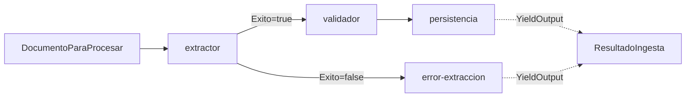

# 🔀 Migración a Microsoft Agent Framework (E2-S1)

> Sustitución del orquestador manual por un **Workflow de Microsoft Agent Framework (MAF)**,
> manteniendo los agentes intactos. Fecha: 2026-07-12. Paquetes: `Microsoft.Agents.AI.Workflows` 1.13.0
> (+ `.Generators`).

## Objetivo y principios

El SPEC (§0.4) preveía desde el día 1 que la orquestación de la Etapa 2 sería MAF. El principio de la
migración: **solo cambia quién encadena los agentes, no los agentes**. `ExtractorAgent`, `ValidadorAgent`
y el repositorio no se han tocado en absoluto — siguen con sus 133 tests verdes.

## Qué se ha hecho

- Interfaz `IIngestaPipeline` con **dos implementaciones conmutables**:
  - `IngestaOrquestador` — orquestador manual de Etapa 1 (se mantiene como **plan B**).
  - `MafIngestaOrquestador` — el nuevo Workflow MAF (activo por defecto).
- Se elige con `Pipeline:Motor` (`Maf` | `Manual`) en config/env. Cambiar al plan B es una línea.
- El Workflow modela **Extractor → Validador → Persistencia** con tres executors que envuelven los
  agentes, y una **arista condicional** después del Extractor:
  - extracción OK → Validador → Persistencia (emite `ResultadoIngesta` de éxito)
  - extracción fallida → executor de error (emite `ResultadoIngesta` de error, no persiste nada)
- Logging estructurado con `correlationId` = id del documento en cada paso.

## Diagrama del workflow

## Problemas encontrados (y soluciones) — el valor real de esta migración

El SPEC marcaba MAF como el componente de mayor riesgo. En la práctica el framework ya es **estable (v1.13,
no preview)** y está bien documentado, pero hay **tres sutilezas no obvias** del modelo de MAF que
costaron descubrir. Todas tienen el mismo origen: **MAF necesita conocer los tipos en tiempo de
construcción**, no solo en ejecución.

| # | Síntoma | Causa | Solución |
|---|---|---|---|
| 1 | `Executor 'ConfigureProtocol' no implementat` al compilar | El registro de handlers `[MessageHandler]` es por **generación de código**; hace falta el paquete generador | Añadir `Microsoft.Agents.AI.Workflows.Generators` |
| 2 | `Executor 'extractor' cannot send messages of type 'X'` | Un handler que devuelve `ValueTask` (void) y hace `SendMessageAsync` manual **no declara** el tipo enviado | Que el handler **devuelva** el tipo (auto-declarado y auto-enviado); el desvío con **aristas condicionales** |
| 3 | `Cannot output object of type ResultadoIngesta. Expecting one of []` | El tipo de salida del workflow no estaba declarado | Atributo **`[YieldsOutput(typeof(ResultadoIngesta))]`** en los executors terminales |
| 4 | El workflow terminaba sin devolver ningún `WorkflowOutputEvent` | Hay que **designar** qué executors producen la salida | **`.WithOutputFrom(persistencia, errorExtraccion)`** en el builder |

**Lección transversal**: MAF es fuertemente tipado en el grafo. El patrón idiomático es *handlers que devuelven
su tipo de salida* + *aristas (condicionales) para el branching* + *`[YieldsOutput]`/`WithOutputFrom`
para los resultados*. Intentar hacerlo "a mano" con `SendMessageAsync`/`YieldOutputAsync` sin declarar
los tipos choca con la validación del grafo.

## Comparación manual vs MAF

| Aspecto | Orquestador manual (E1) | Workflow MAF (E2) |
|---|---|---|
| Encadenamiento | Un método `async` que llama a los agentes en orden | Grafo de executors con aristas |
| Branching | `if (!extraccion.Exito) return ...` | Arista condicional en el grafo |
| Trazabilidad | Logs manuales | Eventos del workflow (`ExecutorInvoked/Completed`, supersteps) + correlationId |
| Curva de aprendizaje | Trivial | Media (las 4 sutilezas de arriba) |
| Paralelismo / fan-out | Manual | Nativo (modelo de supersteps) — pendiente de explotar |
| Coste de cambio de proveedor | — | `IIngestaPipeline` conmutable mantiene el plan B |

## Estado

- ✅ El flujo corre vía Workflow MAF; el orquestador manual queda como plan B conmutable.
- ✅ Verificado con Groq: éxito (`Validada`/`RevisionHumana`), duplicado (`Rechazada`+`DUPLICADO`) y
  documento no-factura (`Rechazada`+`CAMPOS_OBLIGATORIOS`) — mismo comportamiento que E1.
- ✅ 133 tests unitarios verdes (los agentes no se han tocado).
- ✅ Trazabilidad por `correlationId` en los logs.
- ⏳ **Pendiente**: procesamiento en paralelo de N facturas con límite de concurrencia (fan-out) — el
  modelo de supersteps de MAF lo soporta de forma nativa; es la siguiente iteración de S1.

## Riesgo del SPEC: cerrado

El §7 decía "si MAF bloquea más de 2 días, mantener el orquestador manual documentado". No ha hecho falta:
la migración ha funcionado el mismo día. Aun así, **el plan B queda implementado y a un flag de
distancia** (`Pipeline:Motor=Manual`), que es incluso mejor que lo que pedía el SPEC.
