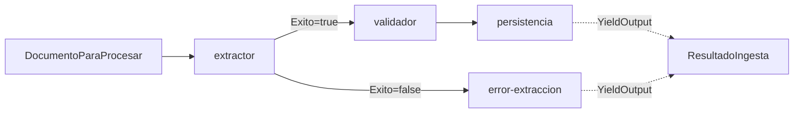

# 🔀 Migració a Microsoft Agent Framework (E2-S1)

> Substitució de l'orquestrador manual per un **Workflow de Microsoft Agent Framework (MAF)**,
> mantenint els agents intactes. Data: 2026-07-12. Paquets: `Microsoft.Agents.AI.Workflows` 1.13.0
> (+ `.Generators`).

## Objectiu i principi

El SPEC (§0.4) preveia des del dia 1 que l'orquestració de l'Etapa 2 seria MAF. El principi de la
migració: **només canvia qui encadena els agents, no els agents**. `ExtractorAgent`, `ValidadorAgent`
i el repositori no s'han tocat gens — segueixen amb els seus 133 tests verds.

## Què s'ha fet

- Interfície `IIngestaPipeline` amb **dues implementacions commutables**:
  - `IngestaOrquestador` — orquestrador manual d'Etapa 1 (es manté com a **pla B**).
  - `MafIngestaOrquestador` — el nou Workflow MAF (actiu per defecte).
- Es tria amb `Pipeline:Motor` (`Maf` | `Manual`) a config/env. Canviar de pla B és una línia.
- El Workflow modela **Extractor → Validador → Persistència** amb tres executors que embolcallen els
  agents, i una **aresta condicional** després de l'Extractor:
  - extracció OK → Validador → Persistència (emet `ResultadoIngesta` d'èxit)
  - extracció fallida → executor d'error (emet `ResultadoIngesta` d'error, no persisteix res)
- Logging estructurat amb `correlationId` = id del document a cada pas.

## Diagrama del workflow

## Problemes trobats (i solucions) — el valor real d'aquesta migració

El SPEC marcava MAF com el component de més risc. A la pràctica el framework ja és **estable (v1.13,
no preview)** i està ben documentat, però hi ha **tres subtileses no òbvies** del model de MAF que van
costar de descobrir. Totes tenen el mateix origen: **MAF necessita conèixer els tipus en temps de
construcció**, no només en execució.

| # | Símptoma | Causa | Solució |
|---|---|---|---|
| 1 | `Executor 'ConfigureProtocol' no implementat` en compilar | El registre de handlers `[MessageHandler]` és per **generació de codi**; cal el paquet generador | Afegir `Microsoft.Agents.AI.Workflows.Generators` |
| 2 | `Executor 'extractor' cannot send messages of type 'X'` | Un handler que retorna `ValueTask` (void) i fa `SendMessageAsync` manual **no declara** el tipus enviat | Que el handler **retorni** el tipus (auto-declarat i auto-enviat); el desvío amb **arestes condicionals** |
| 3 | `Cannot output object of type ResultadoIngesta. Expecting one of []` | El tipus de sortida del workflow no estava declarat | Atribut **`[YieldsOutput(typeof(ResultadoIngesta))]`** als executors terminals |
| 4 | El workflow acabava sense retornar cap `WorkflowOutputEvent` | Cal **designar** quins executors produeixen la sortida | **`.WithOutputFrom(persistencia, errorExtraccion)`** al builder |

**Lliçó transversal**: MAF és fortament tipat en el graf. El patró idiomàtic és *handlers que retornen
el seu tipus de sortida* + *arestes (condicionals) per al branching* + *`[YieldsOutput]`/`WithOutputFrom`
per als resultats*. Intentar fer-ho "a mà" amb `SendMessageAsync`/`YieldOutputAsync` sense declarar
els tipus xoca amb la validació del graf.

## Comparació manual vs MAF

| Aspecte | Orquestrador manual (E1) | Workflow MAF (E2) |
|---|---|---|
| Encadenament | Un mètode `async` que crida els agents en ordre | Graf d'executors amb arestes |
| Branching | `if (!extraccion.Exito) return ...` | Aresta condicional al graf |
| Traçabilitat | Logs manuals | Events del workflow (`ExecutorInvoked/Completed`, supersteps) + correlationId |
| Corba d'aprenentatge | Trivial | Mitjana (les 4 subtileses de dalt) |
| Paral·lelisme / fan-out | Manual | Natiu (model de supersteps) — pendent d'explotar |
| Cost de canvi de proveïdor | — | `IIngestaPipeline` commutable manté el pla B |

## Estat

- ✅ El flux corre via Workflow MAF; l'orquestrador manual queda com a pla B commutable.
- ✅ Verificat amb Groq: èxit (`Validada`/`RevisionHumana`), duplicat (`Rechazada`+`DUPLICADO`) i
  document no-factura (`Rechazada`+`CAMPOS_OBLIGATORIOS`) — mateix comportament que E1.
- ✅ 133 tests unitaris verds (els agents no s'han tocat).
- ✅ Traçabilitat per `correlationId` als logs.
- ⏳ **Pendent**: processament en paral·lel de N factures amb límit de concurrència (fan-out) — el
  model de supersteps de MAF ho suporta de forma nativa; és la següent iteració de S1.

## Risc del SPEC: tancat

El §7 deia "si MAF bloqueja més de 2 dies, mantenir l'orquestrador manual documentat". No ha calgut:
la migració ha funcionat el mateix dia. Tot i així, **el pla B queda implementat i a un flag de
distància** (`Pipeline:Motor=Manual`), que és fins i tot millor que el que demanava el SPEC.
